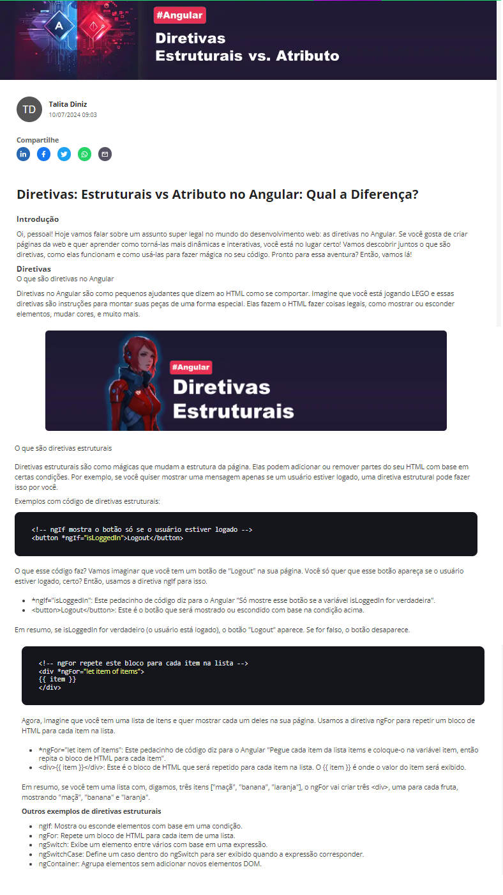

  

# Projeto artigo técnico gerado por I.A.s

 > ℹ️ **NOTE:** Este é o repositório desenvolvido durante o curso da dio do módulo de Criando Artigos Técnicos com ChatGPT e Lexica.art na qual estou participando.

Projeto com o objetivo de gerar um artigo técnico com um layout rico, leitura agradável e com foco em promover sua autoridade técnica.

<a href="https://dio.me/articles/diretivas-estruturais-vs-atributo-no-angular-qual-a-diferenca" title="View PDF now"> 📕Clique aqui para ler o artigo</a>

## 💻 Tecnologias utilizadas no projeto

- [ChatGPT](https://chat.openai.com/) - Para título e conteúdo
- [Lexica.art](https://lexica.art/) e [Midjourney](https://www.midjourney.com/home) - Para gerar imagens
- [PowerPoint](https://www.microsoft.com/en/microsoft-365/powerpoint) - Para formatação de banners e Layouts

## 📄 Prompts e ferramentas

ChatGPT：

|   Ação   | prompt                                                                                                                                                                                                                                                                         |
| :------: | ------------------------------------------------------------------------------------------------------------------------------------------------------------------------------------------------------------------------------------------------------------------------------ |
|  título  | Crie 10 headlines para nomes de artigos sobre o assunto Angular - Diretivas                                                                                                                                                                                                    |
| conteúdo | > Comporte-se como um escritor de artigos tech front-end e escreva o artigo atendendo as regras abaixo

{REGRAS}
> No máximo 5 linhas por blocos de explicação
> Me explique de maneira informal, como se eu fosse uma criança de 10 anos
> Os blocos que serão criados estão abaixo:
- O que são diretivas no angular
- O que são diretivas estruturais
	- Cite exemplos com código de diretivas estruturais
- O que são diretivas de atributos
	- Cite exemplos com código de diretivas atributos
- Faça um call to action para as minhas redes sociais
- Coloque 3 hastags que façam sentido	|

Lexica.art：

- No léxica utilizamos o acervo público de imagens geradas por outras pessoas, os termos de pesquisa que utilizei durante a criação do conteúdo foram:

• Angular Framework
• Red cyberpunk

Midjourney：

- No Midjourney utilizamos o prompt:
  /imagine prompt: A futuristic, tech-inspired illustration focusing on Angular Directives. The artwork should feature abstract elements representing data binding, DOM manipulation, and reusable components. Use a color palette of cool tones like blues and purples with neon accents. Incorporate subtle coding symbols and circuit patterns in the background for a high-tech feel. --ar 16:9 --v 5

## ✨ Features

- Conteúdo gerado via ChatGPT
- Imagens do acervo público geradas via Lexica.art

## 📚 Materiais

- prompts utilizados

## 🛠️ Instruções de execução

Utilize os prompts acima nas ferramentas sugeridas para gerar o material base e utilize uma ferramenta de edição de documentos como power point, libreoffice , indesign para diagramação, o passo a passo em vídeo pode ser conferido na plataforma da [DIO](https://dio.me).

